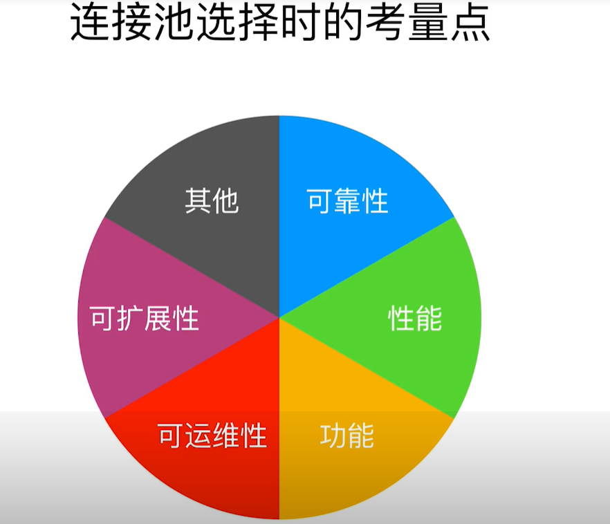

## spring全家桶系列
### 04 leo-spring-druid
本例子主要展示连接池druid的使用

**druid的特性**
* 阿里巴巴出品
* 详细的监控功能
* ExceptionSorter 针对主流数据库的返回码都有支持
* SQL防注入功能
* 内置加密配置
* 众多扩展点，方便进行定制

**知识点一**

druid的配置可以参考 application-db.properties 文件

**知识点二**

如果设置自定义filter，需要将自定义的filter加载到文件META-INF/druid-filter.properties中，
文件中druid.filters.conn要和 application-db.properties中的spring.datasource.druid.filters=conn,config,stat,slf4j 保持一致，
其中config,stat,slf4j是druid默认的

**知识点三**

为了排查干扰，在引入其他数据库连接池的时候，要排除HikariCP
```java
<dependency>
    <groupId>org.springframework.boot</groupId>
    <artifactId>spring-boot-starter-jdbc</artifactId>
    <exclusions>
        <exclusion>
            <artifactId>HikariCP</artifactId>
            <groupId>com.zaxxer</groupId>
        </exclusion>
    </exclusions>
</dependency>
```

**知识点四**

怎么选择连接池？

